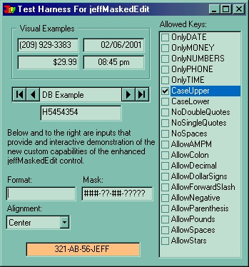



## jeffMaskedEdit \(enhanced vb masked edit control\)

### Description

This control is my replacement for the standard VB masked edit control. It came about by my need to add a .Locked property to the masked edit control... and my utter disgust with the colors and performance of the masked edit controls available in the 3rd party libraries. For the most part, I was pleased with the performance of the MS masked edit control, but it needed some tweaking (in addition to the .Locked property).

For starters, I needed an alignment property because I wanted to use the masked edit with numeric and money fields. Then, for the purpose of money fields, I wanted to be able to apply a .Format, and then programmatically block certain keystrokes (alpha characters, for instance). And referring to fields, yes, it had to be data bindable.

I accomplished all of these things, while retaining the MS masked edit control at the heart of my user control. This preserved the flexibility that was generally lost in the 3rd party controls... and spared me from the much more difficult chore of trying (like other examples I have seen) to implement a masked edit control using a plain ol' text box. In my research, I came across several examples, and none had gone so far as to perfectly preserve the flexibility of the masked edit.

Anyway, this user control adds the following properties to the standard masked edit control: .Alignment, .AutoSelectAll, .Locked, and .AllowedKeys (a clever and easy to enhance enum; check it out).

For updates to this or other useful VB stuff, check my page:                                                                                                          http://members.tripod.com/thefrogprince/                                                                                                          If you are not currently involved in the coding contest, I WOULD REALLY APPRECIATE YOU VOTING FOR MY CODE. Will only take a minute or two to make an account, and while it won't make me any money... =) it will encourage me to keep posting good quality code and controls like this one.
 
### More Info
 

             |
---                |---
**Submitted On**   |2001-08-23 07:25:14
**By**             |[TheFrogPrince](https://github.com/Planet-Source-Code/PSCIndex/blob/master/ByAuthor/thefrogprince.md)
**Level**          |Intermediate
**User Rating**    |4.7 (42 globes from 9 users)
**Compatibility**  |VB 5\.0, VB 6\.0
**Category**       |[Custom Controls/ Forms/  Menus](https://github.com/Planet-Source-Code/PSCIndex/blob/master/ByCategory/custom-controls-forms-menus__1-4.md)
**World**          |[Visual Basic](https://github.com/Planet-Source-Code/PSCIndex/blob/master/ByWorld/visual-basic.md)
**Archive File**   |[jeffMasked252068232001\.zip](https://github.com/Planet-Source-Code/thefrogprince-jeffmaskededit-enhanced-vb-masked-edit-control__1-15075/archive/master.zip)

### API Declarations

No API calls... this is straight roll up yer sleeves VB.

